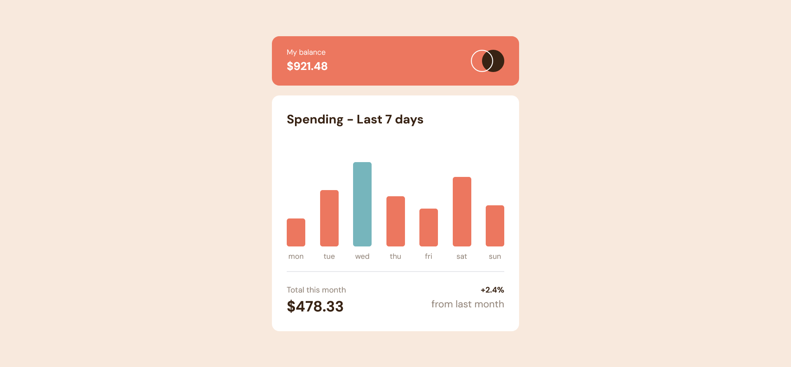

# Frontend Mentor - Expenses chart component solution

This is a solution to the [Expenses chart component challenge on Frontend Mentor](https://www.frontendmentor.io/challenges/expenses-chart-component-e7yJBUdjwt). Frontend Mentor challenges help you improve your coding skills by building realistic projects. 

## Table of contents

- [Overview](#overview)
  - [The challenge](#the-challenge)
  - [Screenshot](#screenshot)
  - [Links](#links)
- [My process](#my-process)
  - [Built with](#built-with)
  - [Continued development](#continued-development)
- [Author](#author)

## Overview

### The challenge

Users should be able to:

- View the bar chart and hover over the individual bars to see the correct amounts for each day
- See the current day’s bar highlighted in a different colour to the other bars
- View the optimal layout for the content depending on their device’s screen size
- See hover states for all interactive elements on the page
- **Bonus**: Use the JSON data file provided to dynamically size the bars on the chart

### Screenshot

### Links

- Solution URL: [https://github.com/mmustaphak/mmustaphak-expenses-chart-component](https://github.com/mmustaphak/mmustaphak-expenses-chart-component)
- Live Site URL: [https://mmustaphak-expenses-chart-component.vercel.app/](https://mmustaphak-expenses-chart-component.vercel.app/)

## My process

### Built with

- Semantic HTML5 markup
- CSS custom properties
- Flexbox
- Mobile-first workflow
- [React](https://reactjs.org/) - JS library
- [Tailwind CSS](https://styled-components.com/) - For styles

### Continued development

I'm looking forward to improve my css and react skills. I'll be looking into transitions and animations for my css and, Routing for React, In Sha Allah. 

## Author

- Frontend Mentor - [@mmustaphak](https://www.frontendmentor.io/profile/mmustaphak)
- Twitter - [@mmustaphak1](https://www.twitter.com/mmustaphak1)
